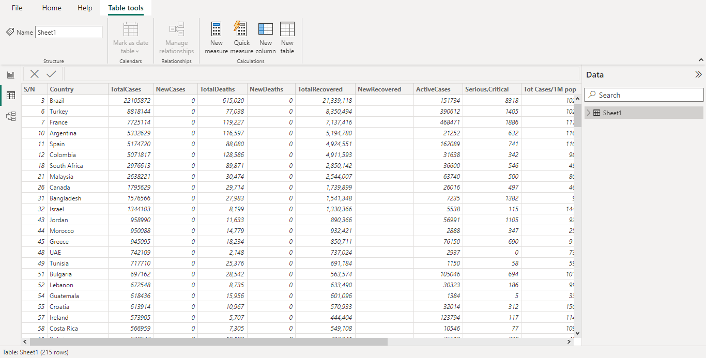
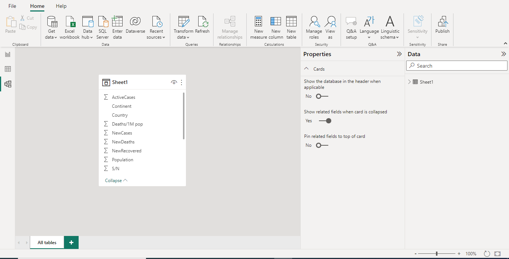
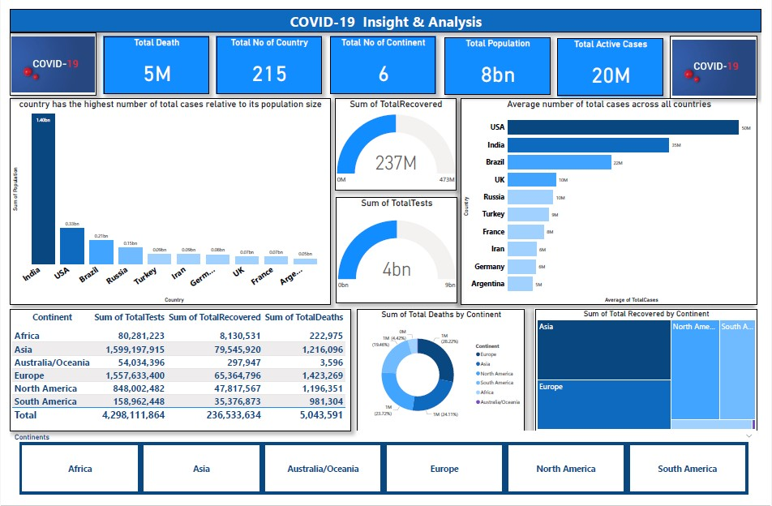

# Covid-19 Insight and Analysis

## Introduction
Covid-19 Insights Analysis is one of the most popular Power BI project ideas among individuals. The project aims to thoroughly overview the pandemic's essential parameters, the latest situation, and detailed country-level evaluations.

*_**Disclaimer**: All dataset and report do not represent any institution but just a dummy dataset to demonstrate the capabilities of Power BI_*

## Problem Statement
- What is the average number of total cases across all countries?
- Which country has the highest number of total cases relative to its population size?
- What is the correlation between total cases and total deaths per country?
- Which country has the highest number of active cases relative to its population size?
- How does the number of new cases in each country compare to the average number of new cases across all countries, based on the most recent data?
- What is the percentage change in total cases and deaths from the previous day/week/month for each country, based on the most recent data?

## Skills/concept demonstrated
The following Power BI skill were incorporated:
  
  
  ---
  -DAX 
  -Quick measures
  -Page navigation
  -Filters
  
  ## Modelling
  No modelling because is a single table
  
  
  ## Visualization
 - The dashboard comprises of:
 - The report comprises of:
-  Total Death
-  Total number of countries
-  Total number of continents
-  Total population 
-  Active Deaths

  You can interact with the power BI dashboard [here](https://app.powerbi.com/groups/me/reports/75dbb73a-5714-4aef-8a1b-3bcfa7957af2/ReportSectionc6ac2be849eb9ff44729?experience=power-bi)
  
  ## Conclusion and Recommendation
  In conclusion, the Covid-19 data analysis project has provided valuable insights and information regarding the impact and spread of the pandemic. Through the analysis of various datasets and visualization techniques, several key findings and conclusions have emerged:

- Transmission Patterns: By analyzing the data, we have identified the transmission patterns of the virus, including the rate of infection and the identification of high-risk areas. 

- Demographic Analysis: The data has allowed for demographic analysis, which has helped identify vulnerable populations, age groups, and comorbidities associated with severe outcomes. 

- Healthcare Capacity: Through the analysis of hospitalization rates, ICU bed occupancy, and ventilator usage, we have gained insights into the strain on healthcare systems.

## Recommendation
Based on the findings and conclusions from the Covid-19 data analysis project, several recommendations can be made to further address the challenges posed by the pandemic and improve our response to future outbreaks:

- Strengthen Data Collection and Reporting: Enhance the collection, standardization, and sharing of Covid-19 data at national and global levels. 

- Improve Surveillance Systems: Invest in robust surveillance systems that can quickly detect and monitor infectious diseases. This involves enhancing early warning systems, expanding testing capabilities, and implementing real-time data integration to enable timely response and targeted interventions.

- Enhance Data Analysis and Modeling: Invest in data analysis and modeling capabilities to improve our understanding of disease transmission, predict future outbreaks, and evaluate the impact of different interventions.

Thank you

You can connect with me on LinkedIn [Here](https://www.linkedin.com/in/israelafolabieasytech/)
